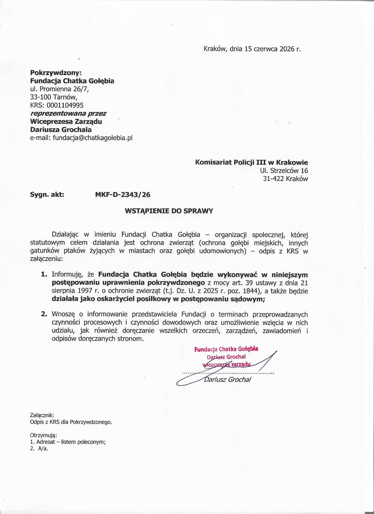

Fundacja Chatka Gołębia przystąpi do sprawy brutalnego zabicia zwierzęcia w charakterze oskarżyciela posiłkowego. Naszym celem jest egzekwowanie przepisów dotyczących ochrony zwierząt i monitorowanie przebiegu postępowania.

## Zdarzenie

Do sklepu sieci "Nasz" sklep na ul. Miechowity 21a wpadł gołąb. Sprawca zaczął uderzać ptaka kijem od szczotki, złapał i rzucił nim o jezdnię. Gołąb nie przeżył.

Zabicie zwierzęcia bez uzasadnionej przyczyny lub w sposób niehumanitarny jest w Polsce przestępstwem ściganym z urzędu na mocy ustawy o ochronie zwierząt. Policja przyjęła zgłoszenie. 

## Interwencja fundacji

Zgodnie z [art. 39 ustawy o ochronie zwierząt](https://lexlege.pl/ustawa-o-ochronie-zwierzat/art-39/) przystąpimy do sprawy dotyczącej brutalnego zabicia zwierzęcia w charakterze oskarżyciela posiłkowego. Naszym celem jest reprezentowanie interesu społecznego oraz działanie na rzecz egzekwowania przepisów chroniących zwierzęta przed przemocą.

Jako organizacja zajmująca się ochroną zwierząt będziemy monitorować przebieg postępowania oraz wspierać działania zmierzające do wyjaśnienia okoliczności zdarzenia. Udział organizacji społecznej w charakterze oskarżyciela posiłkowego pozwala aktywnie uczestniczyć w procesie karnym dotyczącym znęcania się nad zwierzętami i innych przestępstw przeciwko zwierzętom.

O dalszych działaniach oraz przebiegu sprawy będziemy informować na bieżąco na naszych social mediach.

## Wstąpienie do sprawy

